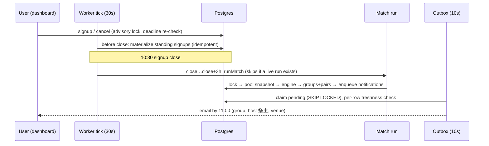

# Sodalis architecture

One Postgres database, two processes built from one codebase:

```
┌──────────────────────────┐     ┌──────────────────────┐
│  Next.js app             │     │  Worker (Bun)        │
│  src/app, components,    │     │  30s scheduler tick  │
│  auth, i18n              │     │  10s outbox dispatch │
└─────────┬────────────────┘     └──────────┬───────────┘
          │        src/lib, src/db          │
          └───────────► PostgreSQL ◄────────┘
```

- `src/lib`, `src/db`, `src/worker` — the **framework-free core**: an ESLint
  `no-restricted-imports` rule forbids `next`, `next/*`, `react` and
  `@/app/*` there (sole exemption: `src/lib/utils.ts`), because the worker
  executes these modules directly with Bun (`bun run src/worker/index.ts`),
  outside the Next build. See [ADR-0002](adr/0002-framework-free-core.md).
- Everything else — `src/app`, `src/components`, `src/auth`, `src/i18n` —
  may freely use Next/React; the boundary is one-directional (framework
  code imports the core, never the reverse).
- There is no Redis, no message broker, no cron daemon: every coordination
  primitive is a Postgres feature (unique keys, advisory locks, an outbox
  table). See [ADR-0001](adr/0001-stack.md), [ADR-0003](adr/0003-db-driven-scheduler.md).

## The daily cycle (per office, office-local time)



Matching itself is a **pure, seeded function** (`src/lib/matching/engine.ts`):
same inputs + seed ⇒ byte-identical groups, which makes production runs
reproducible from their stored seed. See [ADR-0004](adr/0004-matching-engine.md).

## Invariants — what guarantees what

| Guarantee | Mechanism |
|---|---|
| One signup per user × activity × day; a cancelled day can't be re-materialized | unique key on `signups(user_id, activity_type_id, date)` + status `cancelled` rows kept, not deleted |
| At most one live match run per office × activity × day; scheduler double-fire impossible | partial unique index on `match_runs` where status in (pending, running, completed) |
| Signups can't race the matcher (commit after pool snapshot) | shared `pg_advisory_xact_lock(office, activity, date)`; actions re-check the deadline after acquiring it with zero pool queries inside the transaction ([ADR-0003](adr/0003-db-driven-scheduler.md)) |
| No duplicate notification per run × user; re-enqueue is a no-op | unique `notifications.dedupe_key` = `match:{run}:{user}` |
| A superseded run's undelivered emails never go out | supersede cancels pending+sending rows; every dispatcher status write is compare-and-set on `status='sending'`; per-send freshness re-read ([ADR-0005](adr/0005-notification-outbox.md)) |
| Two workers never run loops concurrently | session advisory lock at boot + 60s self-check that exits on lock loss |
| Repeat-penalty history is always the live (non-superseded) truth | `match_pairs` rows are deleted when their run is superseded |
| Admin rights can't be dodged or permanently over-granted | provenance model: sticky `manual`, env-checked `env`, reaffirmation-required `group` ([ADR-0006](adr/0006-admin-provenance.md)) |

## Operational notes

- **Downtime catch-up**: a worker restart inside close+3h materializes missed
  standing signups (rules unchanged since close only) and matches, atomically
  inside the run's lock. Past the window, the day is deliberately skipped.
  Admin re-runs pass the same materialization inputs, so a failed catch-up is
  recoverable by hand. Semantics are snapshot-at-materialization, an accepted
  v1 limitation — see [ADR-0007](adr/0007-snapshot-semantics.md) and issue #2.
- **SLA signal**: the tick warns once per pass when pending notifications are
  older than 15 minutes (SMTP down or slow); per-recipient delivery state is
  in the admin run view.
- **Holiday calendar**: `holiday_calendar` drives working-day logic including
  调休 makeup workdays; refresh it yearly (`bun run holidays:import`), or edit
  in `/admin/holidays`.
- **Verification beyond unit tests**: `scripts/verify/` holds runnable
  PASS/FAIL checks for the concurrency behavior (lock contention, mid-batch
  outbox cancellation on a throwaway database, catch-up recovery). CI runs
  them against a Postgres service container.

## Decision log

All non-obvious decisions, alternatives, and reversals are recorded as ADRs
in [`docs/adr/`](adr/) — start with the index in that directory.
